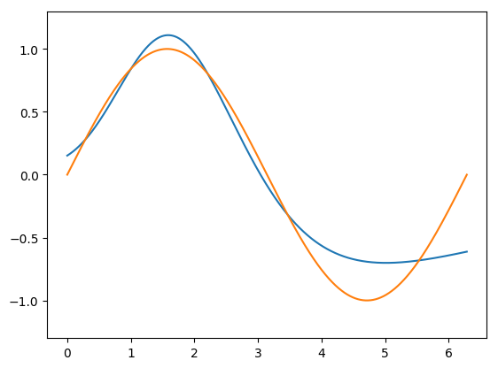
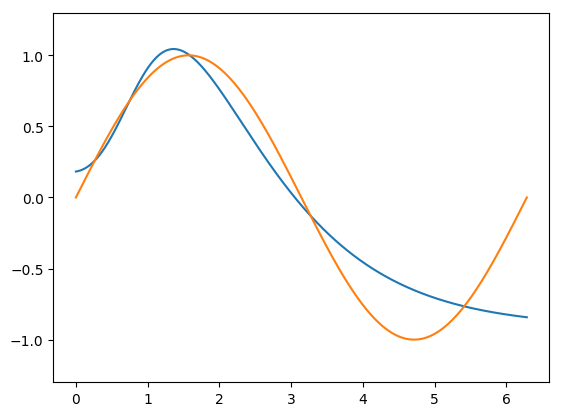
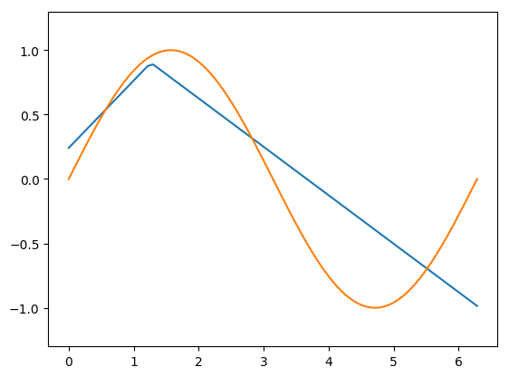
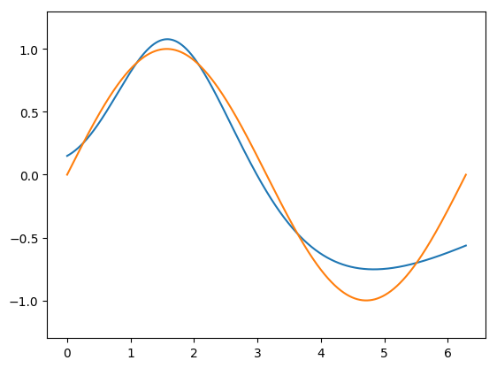
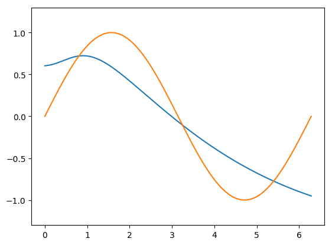
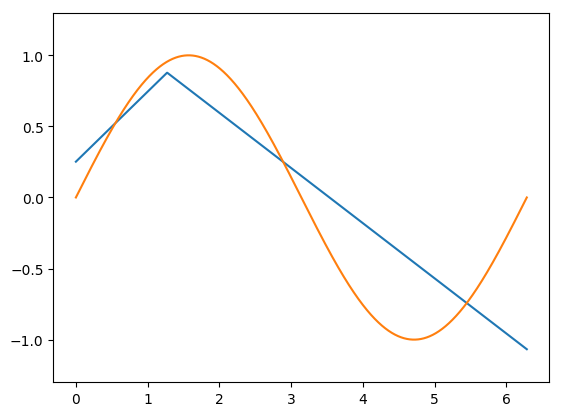

[](http://quantlet.de/)

## [](http://quantlet.de/) **ActivationFunction** [](http://quantlet.de/)

```yaml

Name of Quantlet: ANNSineWave

Published in: Quantlet

Description: 'Train with keras several MLP with one hidden layer
estimating a sinus function to compare activation functions and layer size (neurons number) effect.'

Keywords: Dense, ANN, MLP, deep learning, neural network, activation function, hidden layer

Author: Bruno Spilak

Submitted:  2019-03-22 by Bruno Spilak

Output:
- ANNSineWave1.png
- ANNSineWave2.png
- ANNSineWave3.png
- ANNSineWave4.png
- ANNSineWave5.png
- ANNSineWave6.png
```













### PYTHON Code
```python

import matplotlib
matplotlib.use('TkAgg')
import matplotlib.pyplot as plt
import numpy as np
import keras
from keras.models import Sequential
from keras.layers import Dense, Activation

#from matplotlib.ticker import FormatStrFormatter

# specify the sample size
sample = 4000

# specify the hyperparameters of the neural networks, activation functions list and sizes list of the hidden layer (neurons)
activations = ['tanh', 'sigmoid', 'relu']
hidden_size = [10, 20]

# specify the hyperparameter for training the neural networks
batch_size = 128
epochs = 100

# The sample is interval in [0, 2*pi]
x = np.linspace(0, 2*np.pi, sample)
# Take sinus
y = np.sin(x)

counter = 1
for n in hidden_size:
    for a in activations:
        model = Sequential([
            Dense(n, input_shape=(1,)),
            Activation(a),
            Dense(1),
            Activation('linear'),
        ])
        # For a mean squared error regression problem, we use RMSPROP algorithm
        model.compile(optimizer='rmsprop',
                      loss='mse')
        # Train the model, iterating on the data in batches of 128 samples
        model.fit(x, y, epochs=epochs, batch_size=batch_size)
        pred = model.predict(x)

        fig, ax = plt.subplots()
        ax.plot(x, pred)
        ax.plot(x, y)
        ax.set_yticks([-1, -0.5, 0, 0.5, 1])
        ax.set_ylim(-1.3, 1.3)
        # uncomment to show the plot while running
        #plt.show()
        plt.savefig('ActivationFunction%s.png' % counter, bbox_inches='tight')
        counter +=1 
```

automatically created on 2019-03-22