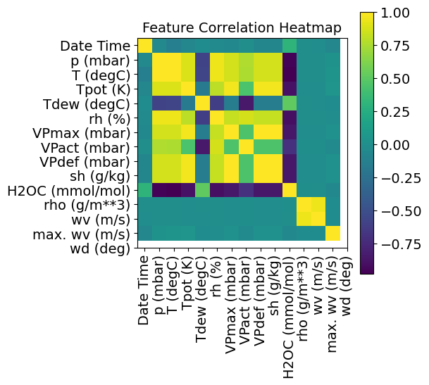
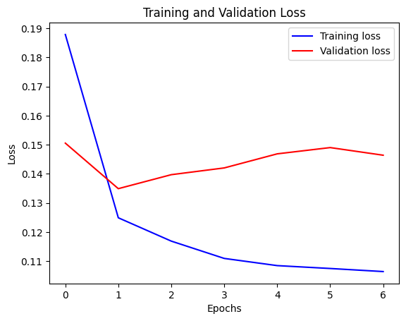
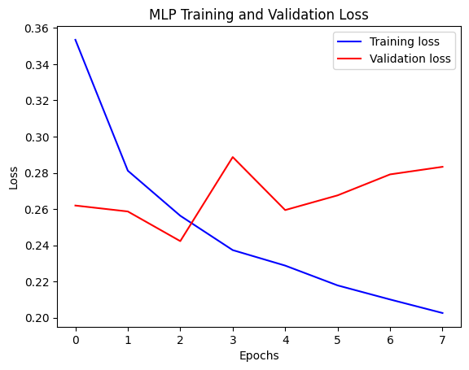

### Abstract of the work:
We provide some simple example of Deep Learning applications.

##  **mnistDeepLearning** 

##  **ANNregression** 

##  **mnistDeepLearning** 

##  **lstmWeatherForecast** 

